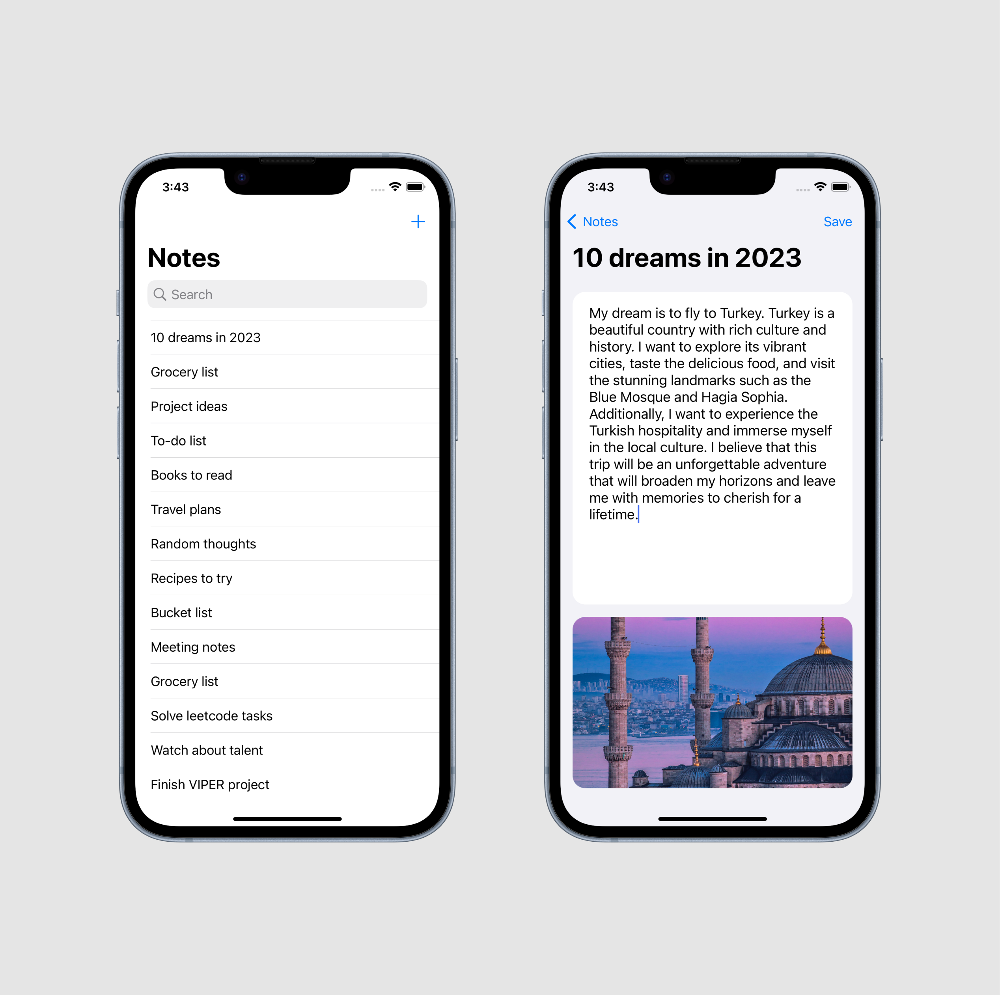

# OneLabHW3

This project is a simple iOS notes app that allows users to create, edit, and delete notes. The app uses Firebase Realtime Database to store the notes data and Firebase Storage to store images. The user can also edit the note's title and description, as well as delete notes. The project is written in Swift and uses the SnapKit library for auto layout.

