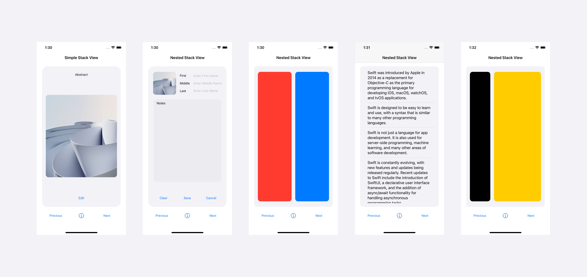
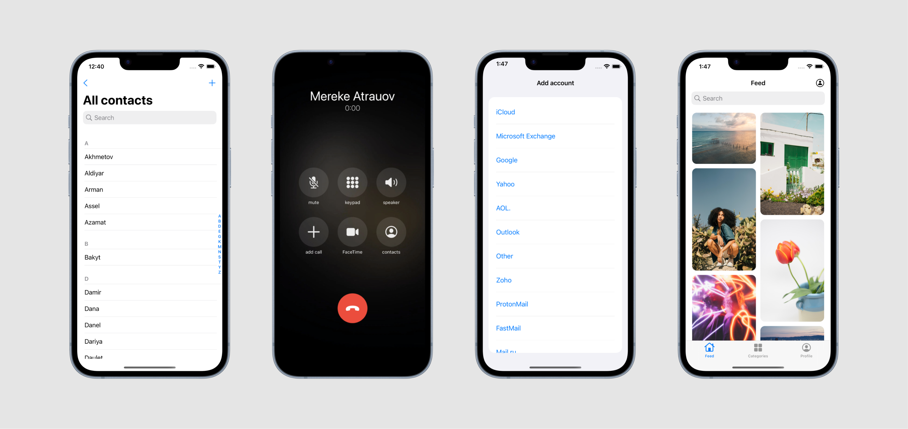
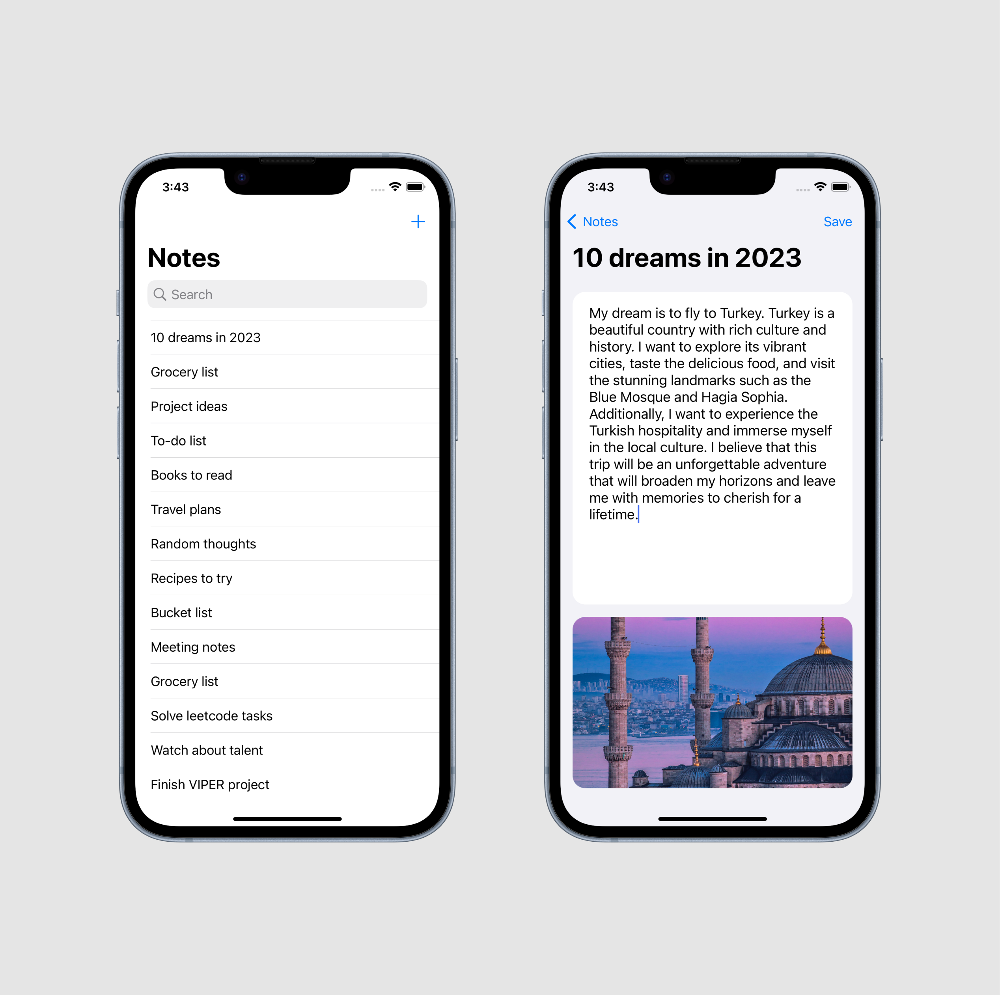
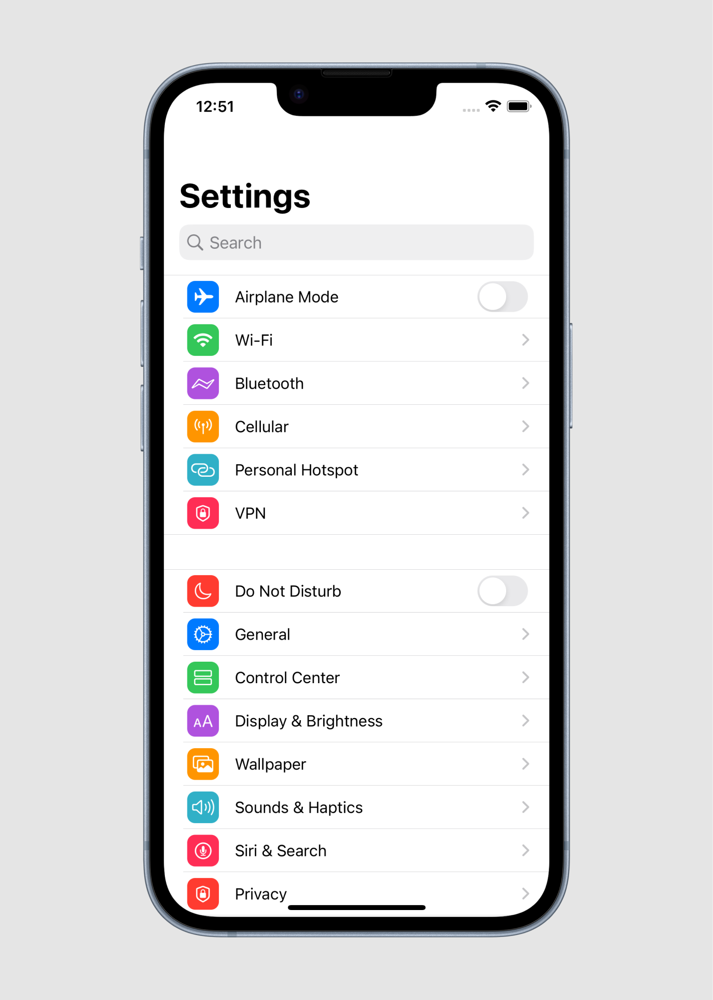

# OneLabHW1

Designed 5 Screens with StackView Autolayout

# OneLabHW2

Made a layout of Contacts, Brand List, Pinterst Layout and Call Screen on UIkit and SwiftUI

# OneLabHW3

Created a simple iOS notes app that allows users to create, edit, and delete notes. The app uses Firebase Realtime Database to store the notes data and Firebase Storage to store images. The user can also edit the note's title and description, as well as delete notes. The project is written in Swift and uses the SnapKit library for auto layout.

# OneLabHW4

Built Settings ios App with MVC, MVVM, MVP, VIP

# OneLabHW5

Developed an iOS app designed to help users manage and organize their book collection

